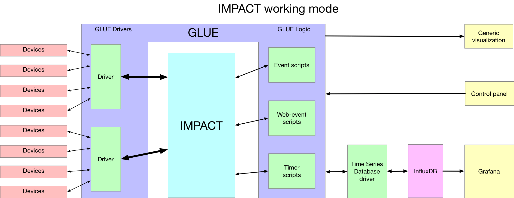
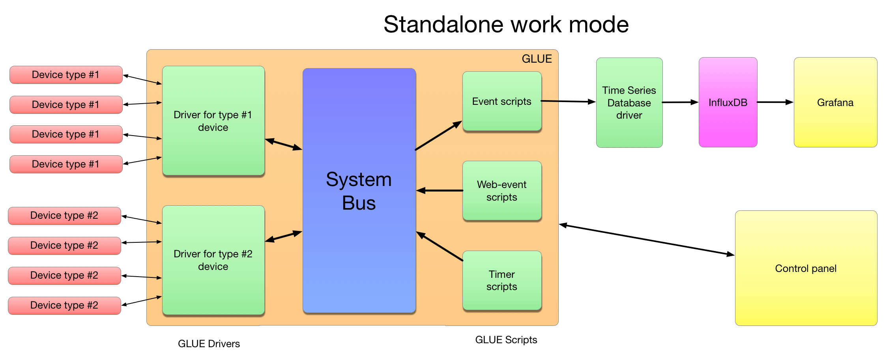
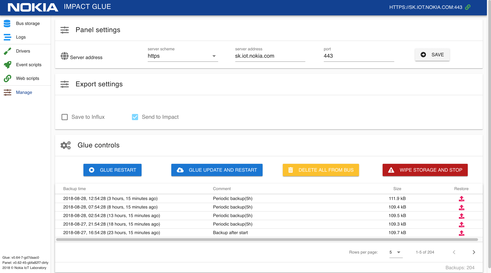
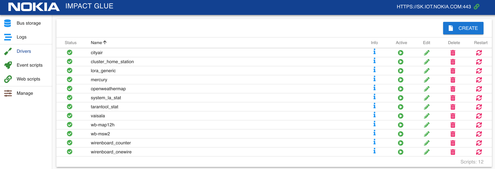
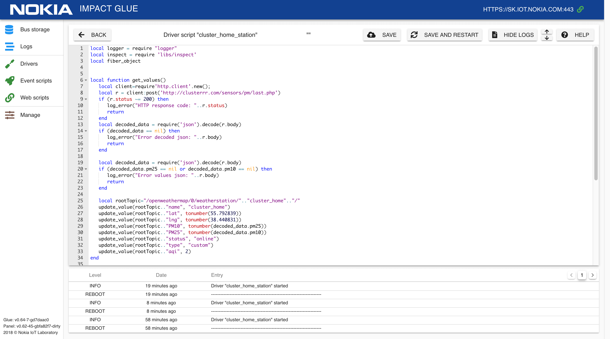
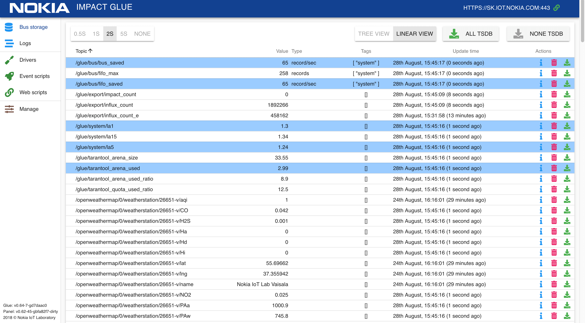
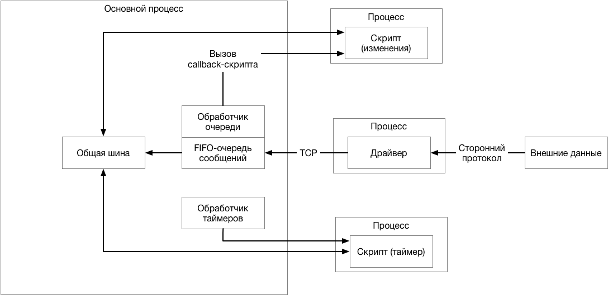
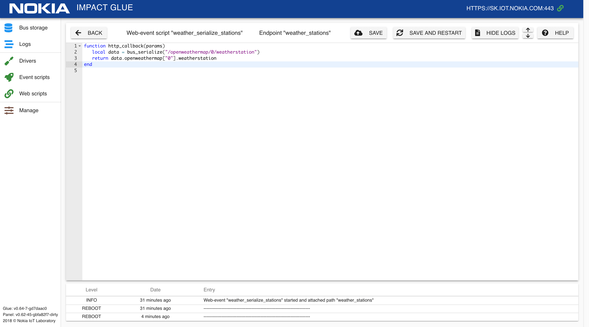

# Что такое Glue?
**Glue** то система управления IoT-устройствами, позволяющая реализовать бизнес-логику и взаимодействие устройств.

### Glue включает в себя:

- **механизм драйверов**, которые обеспечивают конвертацию приходящих от устройств данных в единый формат

- **механизм скриптов**, позволяющих обрабатывать данные с устройств и создавать логику верхнего уровня для определения того, как эти устройства будут работать вместе

- **центральную шину данных (bus)** для хранения текущих данных подключенных устройств

- **драйвера для различных TSDB** выгружать данные в различные TSDB для сбора статистики и последующего анализа

- **систему логгирования** для хранения и отображения событий, ошибок и предупреждений

## Режимы работы Glue  
Glue может работать в нескольких режимах.  

В режиме IMPACT все данные, поступающие с драйверов хранятся в облачном хранилище [Nokia IMPACT](https://networks.nokia.com/solutions/iot-platform)  

  

В режиме Non-IMPACT, все данные хранятся в локальном key-value хранилище на базе платформы Tarantool.  

   

# Состав системы  

## Компоненты системы  

Стандартный пакет установки Glue включает в себя:
- серверную часть ([сервис Glue](https://github.com/vvzvlad/glue)), написанную на Lua с использованием платформы Tarantool, осуществляющую получение, сбор, унификацию, хранение, обработку входящих данных и работу пользовательской логики
- клиентскую часть - панель управления ([Glue Panel](https://github.com/vvzvlad/glue_panel)), обеспечивающую визуализацию данных, создание, редактирование и отладку драйверов и скриптов и управление сервисом Glue

## Установка Glue
1. Установите [Tarantool](https://www.tarantool.io/en/download/)
1. Клонируйте репозиторий: ```git clone https://github.com/vvzvlad/glue.git && cd glue```
1. Установите http: ```sudo tarantoolctl rocks install http```
1. Установите mqtt: ```sudo tarantoolctl rocks install mqtt```
1. Установите dump: ```sudo tarantoolctl rocks install dump```
1. Запустите серверную часть: ```./glue.lua``` (запустится HTTP сервер Tarantool на порту 8080)
1. Установите и запустите панель управления [Glue Webapp](https://github.com/vvzvlad/glue_web_app)
1. При необходимости, укажите адрес HTTP сервера Tarantool на странице настроек в панели управления, если он отличается от localhost:8080

## Панель управления  

Панель управления Glue включает в себя:
- таблицу данных, поступающих на центральную шину (bus) от различных устройств
- список логов, поступающих из различных скриптов и драйверов
- редактор драйверов и пользовательских скриптов (driver, web-event scripts, bus-event scripts, ...)
- страница с настройками

  

На странице с настройками можно 
- выбрать сервер, с которым будет работать панель
- выбрать TSDB, в которую будет происходить экспорт данных
- перезапустить сервис Glue
- перезапуск Glue с обновлением (git pull из репозитория)
- удалить все данные из центральной шины
- очистить все хранилище данных
 

## Drivers
Драйвера — это скрипты на Lua, которые реализуют тот или иной протокол(часто с привлечением сторонних библиотек) для связи с устройством, конвертируя данные приходящие с каждого устройства в единый формат. Они работают в качестве транслятора между "языком" устройства и "языком" общей шины. 

Драйвера хранятся во NoSQL хранилище Tarantool.  
Используя встроенный в Glue Panel редактор скриптов, вы можете создавать, тестировать и запускать практически любые скрипты драйверов на языке Lua.



Скрипты можно создавать, редактировать, включать/отключать, перезапускать и удалять.



В процсессе создания или редактирования пользовательских скриптов (драйверы, bus-event scripts, web-event scripts), доступны:  
- внутренние переменные
- функции логгирования
- функции для работы с центральной шиной

### Внутренние переменные скрипта
**script_name** - перменная, содержащая название текущего скрипта  
**_script_uuid** -  переменная, содержащая uuid (уникальный идентификатор) текущего скрипта  
**store** - таблица для хранения временных данных, уникальная для каждого скрипта.  Ее можно использовать просто как переменную:  
```lua
store.value = 5 
print(store.value) -- 5
```

### Функции для работы с логами

**log_info()** - добавляет в лог запись уровня "INFO"  
**log_warning()** - добавляет в лог запись уровня "WARNING"  
**log_error()** - добавляет в лог запись уровня "ERROR"  
**log_user()** - добавляет в лог запись уровня "USER"  
**log()** - аналогично функции log_user()  
**print()** - аналогично функции log_user()   

### Функции для работы с центральной шиной

**update_value(topic, value)**: Обновляет топик, устанавливая значение "value"   
**shadow_update_value(topic, value)**: Обновляет топик, устанавливая значение "value", но не запускает event-скрипты, которые подписаны на этот топик.  
**get_value(topic)**: Получает значение топика  
**bus_serialize(pattern)**: Получает содержимое центральной шины (bus) в виде вложенной таблицы. Если передана переменная "pattern", то будет выбрана только часть таблицы, соответствующая заданному шаблону. Шаблоны соответствуют правилам [lua patterns](https://www.lua.org/pil/20.2.html)

Данные, поступающие в драйвер могут обновлять значение топика в стандартном (standard) или теневом (shadow) режиме. В первом случае, отработают все скрипты, которые прослушивают изменения значения, во втором случае, значение будет изменено без запуска скриптов. При обновлении самим скриптом топика, на который он подписан, коллбек топика вызываться не будет.


## Bus  

Общая шина — это быстрая in-memory база данных ключ:значение, в которой ключом является стандартизованный адрес устройства или датчика, а значением — последние данные с этого устройства или датчика.



Данные, поступающие в шину обновляются в веб-панели с интервалом, заданным пользователем (от 0.5 до 5 сек). Существует и возможность приостановить обновление данных.

Данные могут быть представлены в виде списка или древовидной иерархии, генерируемой на основе названия топика.

Экспорт значений можно включать и отключать индивидуально для каждого источника. Для экспорта может использоваться [InfluxData (InfluxDB)](https://www.influxdata.com/) или [Nokia IMPACT](https://networks.nokia.com/solutions/iot-platform).  

  

Включить экспорт данных в IMPACT или InfluxDB можно на странице настроек (пункт Manage в левом боковом меню).

## Scripts  

Скрипты — это обособленные части кода, которые реализуют прикладную логику: расчет, изменение, реакции, выдача данных.  
Скрипты бывают нескольких видов: 
- **bus-event**
- **timer-event** 
- **web-event**

Timer-event и Bus-event скрипты работают по следующему принципу: 


### Bus-event scripts  

Этот тип скриптов выполняется для каждого устройства из группы устройств, определяемых маской, при обновлении их данных на центральной шине.


При создании скрипта, необходимо использовать функцию **event_handler()**, в которую можно передать значение "value" и название топика соответствующего события на шине.  

```lua
function event_handler(value, topic)
   -- Ваш код здесь
end
```  

Пример кода, который прослушивает изменение показаний концентрации угарного газа CO на климатической станции и обновляет значение приращения этого значения для отслеживания динамики:  

```lua
function event_handler(value)
   store.old_value = store.old_value or 0
   difference =  value - store.old_value
   update_value("/wb/AN4SSJFL/vaisala/26651/CO_d", difference)

   store.old_value = value
end
```  

  

<!-- ### Timer-event scripts
Таймер - каждые N минут например (или через столько-то минут?)

Scheduled - запланированное время в формате HH:mm или DD:HH:MM ? (1 раз или солько?) -->

### Web-event scripts

Скрипты, выполняемые при обращении к выбранному URL ("endpoint") с помощью HTTP запроса.  

 

Функция, реализующая непосредственную логику при обработке запроса - **http_callback()**.

В скриптах доступны переменные, содержащие данные запроса: 
- **params** - массив с параметрами запроса
- **req** - объект запроса [HTTP сервера Tarantool](https://github.com/tarantool/http)  

 

```lua
function http_callback(params, req)
   -- Ваш код здесь
end
```  

Если в функции **http_callback()** вернуть одно значение (напр. return table), то оно будет сериализовано в JSON.
Если нужно, чтобы функция вернула результат без сериализации, то можно вернуть 2 значения (напр. return nil, "OK"), тогда первое значение будет отброшено, а второе - выдано в "сыром" виде без сериализации.  

Пример скрипта, который сериализует в JSON выборку данных из шины по маске _"/openweathermap/0/weatherstation"_ и отдает по HTTP при обращении:  

```lua
function http_callback(params)
   local data = bus_serialize("/openweathermap/0/weatherstation")
   return data.openweathermap["0"].weatherstation
end
```  

В результате обращения к URL _/we/weather_stations_, что соответствует endpoint'у "weather_stations", получаем данные, сериализованные в JSON:  

 

