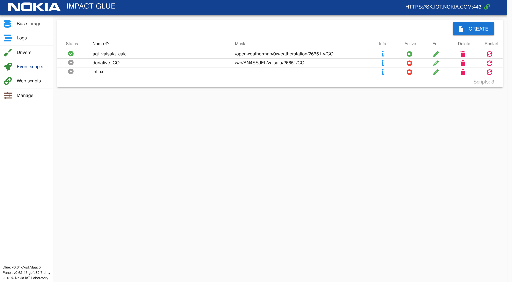
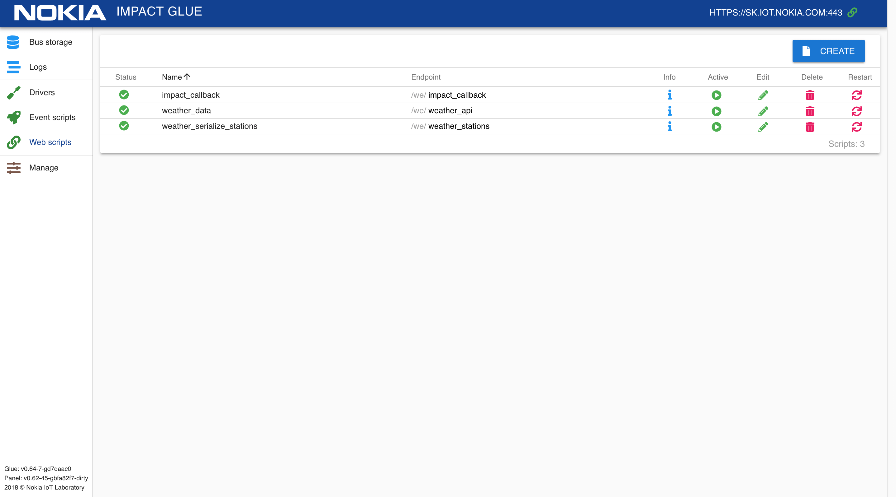
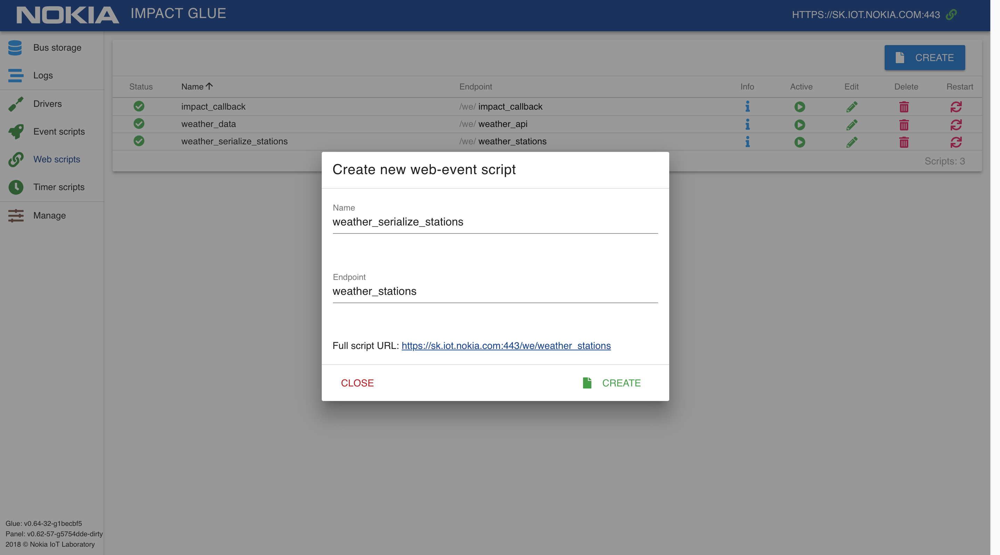
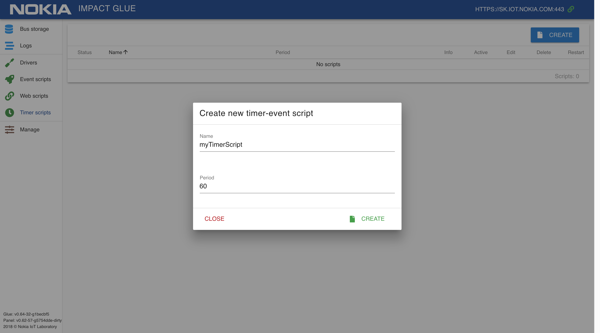
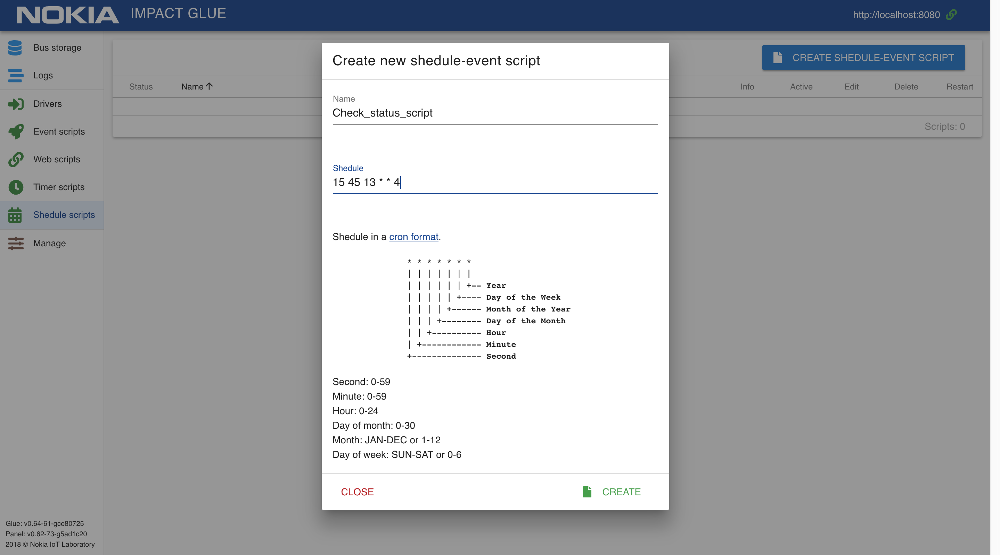

# Документация разработчика

## Общая информация

### Внутренние переменные скрипта
`_script_name` - переменная, содержащая название текущего скрипта  
`_script_uuid` -  переменная, содержащая uuid (уникальный идентификатор) текущего скрипта  
`store` - таблица для хранения временных данных, уникальная для каждого скрипта. Ее можно использовать просто как переменную:
```lua
store.value = 5
print(store.value) -- 5
```

`main_store` - таблица, в которой находятся хранилища всех запущенных с момента запуска системы скриптов.  
Первый уровень таблицы — UUID скриптов. Второй уровень — store каждого скрипта. UUID скрипта можно узнать, нажав на значок "i" в интерфейсе. С помощью этой таблицы можно получать доступ к хранилищам других скриптов:
```lua
store.table = {1,2,3,4,5}
print(main_store["8d72fe2f-801e-48d1-ac1a-526f3e2622c0"].table) -- { 1, 2, 3, 4, 5 }
```
Например, это позволяет передавать между скриптами функции или таблицы, которые нельзя напрямую передать через BUS.  

### Функции для работы с логами

#### Функции log_info(), log_warning(), log_error(), log_user()
Добавляют в системный лог запись уровня "INFO", "WARNING", "ERROR" и "USER" соответственно.  
Использование: `log_info("Found correlation!")`, `log_warning("Found correlation!")` , `log_error("Found correlation!")` , `log_user("Found correlation!")`  
Ничего не возвращает.  

#### Функции log() и print()
`log()` - алиас для функции log_user()  
`print()` - алиас для функции log_user()  

### Функции для работы с центральной шиной

#### Функция set_value()
Обновляет топик "topic", устанавливая значение "value".  
Использование: `set_value(topic, value, check_flag, update_time)`  
Ничего не возвращает.  

Параметр **check_flag** определяет, будет ли проверяться перед изменением значение изменяемого топика.  
Если параметр check_flag равен "CHECK_VALUE", то функция проверит равенство передаваемого в нее значение и старого значения в топике, и если они равны — не будет обновлять топик(не будут запущены событийные скрипты, и не будет обновлено время обновления топика). Если параметр равен чему-то другому (или не передается вообще, т.е. равен nil), то проверки производиться не будет, и значение топика будет обновлено в любом случае.  
Это поведение используется для случаев, когда функции могут вернуть значение, равное значению топика, и логика работы такова, что при этом нет необходимости активировать событийные скрипты.  

Параметр **update_time** переопределяет время обновления топика. Если update_time не указано, используется текущее системное время. Формат update_time — unix-time в секундах текущего часового пояса, допускаются десятые, сотые и тысячные доли.   
Это поведение используется, например, если в драйвере запрашиваются исторические данные через API и необходимо, чтобы в выгрузку в TSDB они ушли с временем из истории, а не с текущим. Тогда в BUS загружаются исторические данные, используя параметр update_time, и они с этим временем выгружаются в TSDB.  
Обратите внимание, что поле Update time в bus storage в этом случае не будет соответствовать реальности — несмотря на то, что топик был обновлен только что, время обновления в интерфейсе будет равно переданному в set_value параметру update_time.  

Примеры использования: 
```lua
set_value("/test/device", "5")
set_value("/test/device", "5", nil, os.time()-60*60)
set_value("/test/device", "5", "CHECK_VALUE", os.time()-60*60*2)
```

#### Функция shadow_set_value()
Обновляет топик, устанавливая значение "value", но не запускает event-скрипты, которые подписаны на этот топик.  
Использование: `shadow_set_value(topic, value)`  
Ничего не возвращает.  

Данные, поступающие из драйверов или скриптов, могут обновлять значение топика в стандартном (standard) или теневом (shadow) режиме. В первом случае, отработают все скрипты, которые подписаны на изменения значения топика, во втором случае, значение будет изменено без запуска скриптов. При обновлении самим скриптом топика, на который он подписан, коллбек в скрипте вызываться не будет.  

#### Функция get_value()
Получает значение и метаинформацию топика.  
Использование: `local value, update_time, type, tags = get_value(topic)`  
Возвращает поля value, update_time, type, tags  <!-- Расписать подробнее в описании функции, что за поля и в каком виде -->  

#### Функция bus_serialize()
Получает содержимое центральной шины (bus) в виде вложенной таблицы.  
Использование: `local table = bus_serialize(pattern)`  
Возвращает таблицу. Если передана переменная "pattern", то будет выбрана только часть таблицы, соответствующая заданному шаблону. Шаблоны соответствуют правилам [lua patterns](https://www.lua.org/pil/20.2.html) <!-- нужен пример -->  

### Вспомогательные функции

#### Функция round()
Функция для "правильного" математического округления с произвольной точностью.  
Получает число и количество знаков после запятой, возвращает округленное число. Если количество знаков не указано, используется 2.  
Использование: `local round_value = round(value, rounds)`  

Примеры использования: 
```lua
local value = 3.1415926535
print(round(value)) --> 3.14
print(round(value, 2)) --> 3.14
print(round(value, 3)) --> 3.142
```

#### Функция deepcopy()
Функция для копирования таблиц lua(если попытаться скопировать таблицу `table_a = table_b`, мы получим две ссылки на одну и ту же таблицу).  
Получает таблицу, возвращает копию таблицу. Таблица не должна быть рекурсивной, иначе функция переполнит стек.  
Использование: `local copy_table = deepcopy(table)`  

Пример использования: 
```lua
local old_table = {1, 2, 4}
local copy_table = deepcopy(old_table)
```

### Встроенные библиотеки
Для использования этих библиотек не нужно делать require, они уже есть в области видимости каждого скрипта.  

#### Библиотека HTTP Client
Библиотека, реализующая примитивы для http-запросов.  
Уже созданный экземпляр доступен через объект `http_client`, т.е. для метода `request()` нужно вызвать `http_client.request()`  
Пример использования:  
```lua
local r = http_client:get('http://google.com')
print(r.body)
``` 
[Документация](https://www.tarantool.io/en/doc/1.9/reference/reference_lua/http/)  


#### Библиотека MQTT
Библиотека, реализующая клиента протокола MQTT. Доступна через объект `mqtt`  
Пример использования:  
```lua
local mqtt_object = mqtt.new("client_id", true)
mqtt_object:connect({ host='127.0.0.1', port=1883 })
ok, err = mqtt_object:subscribe('my/topic/#', 1)
ok, err = mqtt_object:publish('my/topic/#', 'Some payload as string', mqtt.QOS_0, mqtt.RETAIN)
``` 
[Документация](https://github.com/tarantool/mqtt)  


#### Библиотека JSON
Библиотека, конвертирующая таблицы lua в json и обратно. Доступна через объект `json`  
Пример использования:  
```lua
json.encode({abc = 234, cde = 345}) --> '{"cde":345,"abc":234}'
json.decode('[123, "hello"]') --> [123, 'hello']
```
[Документация](https://www.tarantool.io/en/doc/1.9/reference/reference_lua/json/)  


#### Библиотека Socket
Библиотека для доступа к системным сокетам. Доступна через объект `socket`  
Пример использования:  
```lua
local sock_1 = socket('AF_INET', 'SOCK_DGRAM', 'udp')
local sock_2 = socket('AF_INET', 'SOCK_DGRAM', 'udp')
sock_1:bind('127.0.0.1')
sock_2:sendto('127.0.0.1', sock_1:name().port,'X')
message = sock_1:recvfrom()
print(message) --> X
```
[Документация](https://www.tarantool.io/en/doc/1.9/reference/reference_lua/socket/)  


#### Библиотека Fiber
Библиотека для работы с потоками. Доступна через объект `fiber`  
Не стоит подключать библиотеку fiber вручную, т.е. делать "local fiber = require 'fiber'".  
В этом случае, ошибки внутри тредов fiber не попадут в лог конкретного скрипта и не сгенерируют ошибку, что усложняет отладку.  
В библиотеке доступны методы `fiber.sleep()`, `fiber.create()`, `fiber.kill()`, `fiber.yield()`, `fiber.self()`, `fiber.status()`. Для остальных нужно делать require и оборачивать функции, которые запускаются через `fiber.create()` в `pcall()`/`xpcall()`.  
Пример использования:  
```lua
local function loop()
   while true do
      print("tick")
      fiber.sleep(1.2) --seconds
   end
end
fiber.create(loop)
``` 
[Документация](https://www.tarantool.io/en/doc/1.9/reference/reference_lua/fiber/)  


## Скрипты и драйвера

### Drivers
Драйвера — это скрипты на Lua, которые реализуют тот или иной протокол(часто с привлечением сторонних библиотек) для связи с устройством, конвертируя данные приходящие с каждого устройства в единый формат. Они работают в качестве транслятора между "языком" устройства и общей шиной.  
<!-- описать драйвера подробнее, нарисовать диаграмму жизненного цикла -->  
[Примеры драйверов](examples_driver.md)

### Bus-event scripts

Этот тип скриптов выполняется для каждого устройства из группы устройств, определяемых маской, при обновлении их данных на центральной шине.  
  

В теле скрипта должна присутствовать функция `event_handler()`, в которую будет передано значение измененного топика и его адрес:

```lua
function event_handler(value, topic)
   print(value, topic) --> "5 /test/device"
end
```

Также, в теле скрипта, можно создать функции `init()` и `destroy()`, которые будут вызваны при инициализации скрипта и его выгрузке соответственно.  
Это может быть полезно, например, если нужно сделать экспорт множества топиков по маске в MQTT.  

У Bus-event скриптов существует возможность однократного запуска нажатием кнопки **"Run Once"** на странице редактиования скрипта или на странице со списком скриптов.  
При однократном запуске, принудительно запускается `event_handler()` c аргументами `value=0`, `topic="once"`. Не выполняются `init()` и `destroy()`. 
Однократный запуск полезен для отладки и совершения разовых действий.  


[Примеры bus-event скриптов](examples_bus_event.md)


### Web-event scripts

Скрипты, выполняемые при обращении к выбранному URL ("endpoint") с помощью HTTP запроса.  



Функция, реализующая непосредственную логику при обработке запроса — `http_callback()`.  

При создании web-event скрипта, необходимо дать ему название и указать endpoint.  
Полный адрес скрипта формируется как `адрес_сервера:порт` + `/we/` + `endpoint` и отображается в нижней части модального окна как "Full script URL".  



В скриптах доступны переменные, содержащие данные запроса:  
- `params` - массив с параметрами запроса  
- `req` - объект запроса [HTTP сервера Tarantool](https://github.com/tarantool/http)  

```lua
function http_callback(params, req)
   return {data=params}
end
```

Если в функции `http_callback()` вернуть одно значение-таблицу (напр. `return table`), то она будет сериализована в JSON и в таком виде отдана клиенту http-сервера.  
Если необходимо управлять возвращаемыми данными напрямую, то надо вернуть 2 значения (напр. `return nil, 'OK'`), тогда первое значение будет отброшено, а второе - выдано клиенту в "сыром" виде без сериализации.  
Для дополнительных сведений смотрите документацию [HTTP сервера Tarantool](https://github.com/tarantool/http)  

[Примеры web-event скриптов](examples_web_event.md)

### Timer-event scripts

Скрипты, выполняемые с определенным интервалом (указывается в секундах).  



Для создания скрипта, укажите его название и желаемый интервал его выполнения в секундах.  

Код скрипта должен находиться внутри функции `event_handler()`.  

```lua
function event_handler()
   print("Timer event start")
end
```

[Примеры timer-event скриптов](examples_timer_event.md)

### Schedule scripts

Скрипты, выполняемые по заданному расписанию.  



Для создания скрипта, укажите его название и расписание в формате [crontab](https://en.wikipedia.org/wiki/Cron).  
Формат отличается от стандартного необходимостью указания секунд в интервале (первый символ). Если вам не нужны секунды, укажите в первом символе "0". Не указываете там "*", иначе скрипт будет запускаться каждую секунду в подходящих интервалах.   

```
┌───────────── секунды (0 - 59)
│ ┌───────────── минуты (0 - 59)
│ │ ┌───────────── часы (0 - 23)
│ │ │ ┌───────────── дни месяца (1 - 31)
│ │ │ │ ┌───────────── месяца (JAN-DEC или 1 - 12)
│ │ │ │ │ ┌───────────── день недели (SUN-SAT или 0 - 6) (с воскресения до субботы)
│ │ │ │ │ │
│ │ │ │ │ │
* * * * * *
```

К примеру, с такими настройками расписания, скрипт будет запускаться по четвергам в 13:45:15  

```
 15 45 13 * * 4
```

Код скрипта должен находиться внутри функции `event_handler()`.  

```lua
function event_handler()
   print("Shedule event start")
end
```

[Примеры shedule-event скриптов](examples_shedule_event.md)
