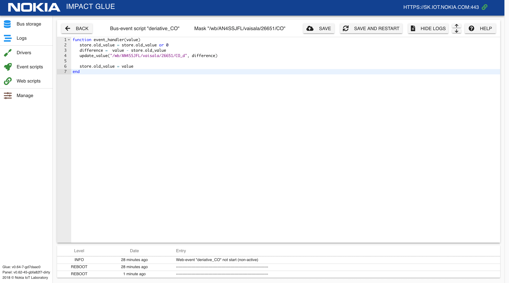

# Примеры bus-event скриптов

## Расчет скорости роста параметра

Пример кода, который прослушивает изменение показаний концентрации угарного газа CO на климатической станции и обновляет значение приращения этого значения для отслеживания динамики:  

```lua
function event_handler(value)
   store.old_value = store.old_value or 0
   difference =  value - store.old_value
   set_value("/wb/AN4SSJFL/vaisala/26651/CO_d", difference)

   store.old_value = value
end
```


