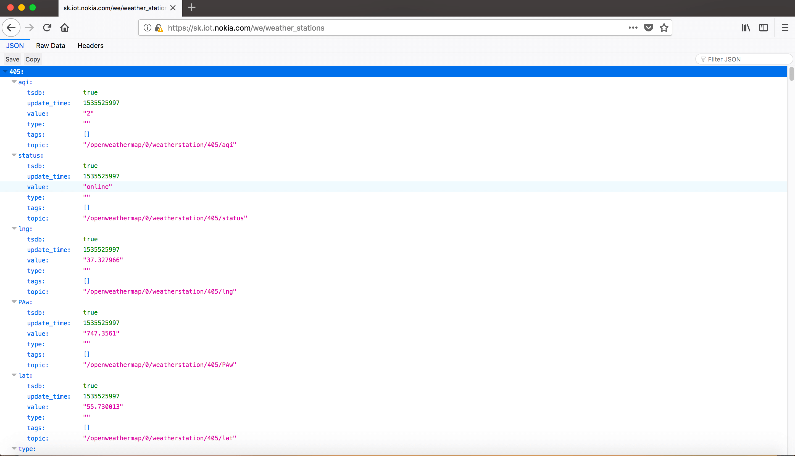

# Примеры web-event скриптов

## Сериализация значений bus

Скрипт, который сериализует в JSON выборку данных из шины по маске _"/openweathermap/0/weatherstation"_ и отдает по HTTP при обращении:  

```lua
function http_callback(params)
   local data = bus_serialize("/openweathermap/0/weatherstation")
   return data.openweathermap["0"].weatherstation
end
```

В результате обращения к endpoint'у скрипта "weather_stations", получаем данные, сериализованные в JSON:  


