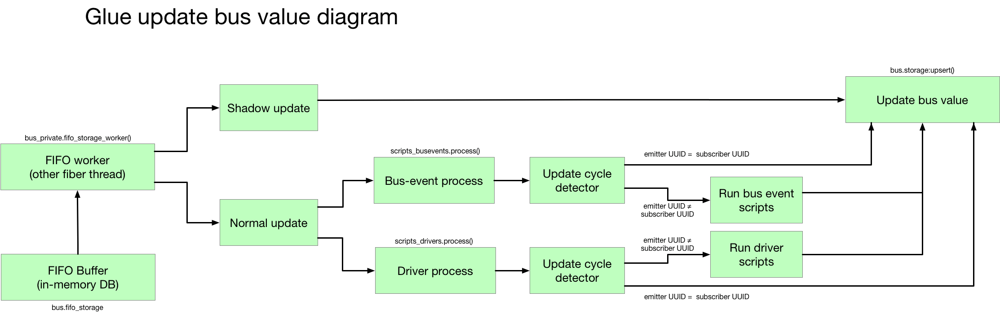

# О внутренностях системы

Для тех, кому документации оказалось мало. 

## Статусы и флаги скриптов

### Статусы
Определяет текущий статус скрипта — в каком состоянии скрипт пребывает сейчас. Определяется системой — в ходе работы скрипта и системы.  
Статусы:
* ERROR
* WARNING
* NORMAL
* STOPPED

### Флаги
Определяет, необходимо ли использовать скрипт, или нет. Определяется пользователем.  
Флаги:
* ACTIVE
* NON_ACTIVE

## Системная диаграмма механизма обновления данных на шине

