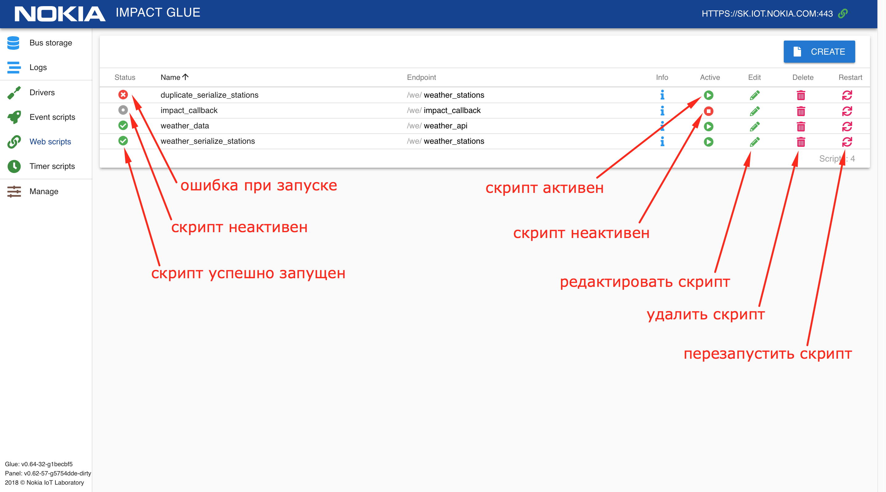

# Панель управления

Панель управления Glue включает в себя:
- таблицу данных, поступающих на центральную шину (bus) от различных устройств
- список логов, поступающих из различных скриптов и драйверов
- редактор драйверов и пользовательских скриптов (driver, web-event scripts, bus-event scripts, ...)
- страница с настройками

На странице с настройками можно
- выбрать сервер, с которым будет работать панель
- выбрать TSDB, в которую будет происходить экспорт данных
- перезапустить сервис Glue
- перезапустить Glue с обновлением (выполняется git reset --hard, будут перезаписаны все изменения в коде Glue! )
- удалить все данные из центральной шины
- очистить все хранилище данных

## Bus

Общая шина — это быстрая in-memory база данных ключ-значение, в которой ключом является стандартизованный адрес устройства или датчика, а значением — последние данные с этого устройства или датчика.
Дополнительно, на шине хранится метаинформация - время получения последнего события, тип (единица измерения, например) и набор тегов.

Данные, поступающие в шину обновляются в веб-панели с интервалом, заданным пользователем (от 0.5 до 5 сек). Существует и возможность приостановить обновление данных.

Данные могут быть представлены в виде списка или древовидной иерархии, генерируемой на основе названия топика.

Экспорт значений можно включать и отключать индивидуально для каждого источника. Для экспорта может использоваться [InfluxData (InfluxDB)](https://www.influxdata.com/) или [Nokia IMPACT](https://networks.nokia.com/solutions/iot-platform).

Включить экспорт данных в IMPACT или InfluxDB можно на странице настроек (пункт Manage в левом боковом меню).

## Scripts
Скрипты — это обособленные части кода, которые реализуют прикладную логику: расчет, изменение, реакции, выдача данных.
Скрипты бывают нескольких видов:
- **drivers**
- **bus-event**
- **web-event**
- **timer-event**

Скрипты могут находиться в активном и неактивном состоянии.  
Скрипт, находящийся в активном состоянии, Glue будет пытаться включить непосредственно в момент активации и каждый раз при перезапуске. Скрипт можно принудительно перезапустить, если это необходимо.  
Неактивные скрипты никак не участвуют в работе системы до момента их активации.  

При успешном запуске скрипта, его статус изменяется на "Started". В случае, если возникли какие-либо ошибки, это будет отображено в его статусе, а в логах будет указана причина ошибки.  

Используя встроенный в Glue Panel редактор скриптов, вы можете создавать, тестировать и запускать скрипты драйверов на языке Lua.  

  

Скрипты можно создавать, редактировать, включать/отключать, перезапускать и удалять.  

  
