# Панель управления

## Панель просмотра данных шины  

Панель просмотра данных предназначена для отображения значений топиков в режиме реального времени.  

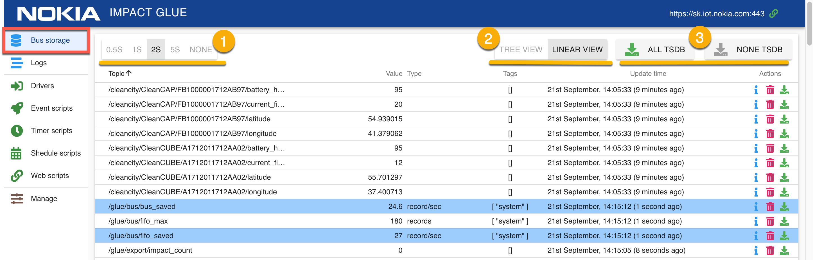

В верхней части панели расположены элементы управления:  
1. Переключатель частоты обновления данных в панели. Данные, поступающие в шину обновляются в веб-панели с интервалом, заданным пользователем (от 0.5 до 5 сек). Существует и возможность приостановить обновление данных ("NONE").
2. Переключатель между линейным и древовидным режимами отображения. 

### Линейный и древовидный режим отображения  

Данные могут быть представлены в виде списка или древовидной иерархии, генерируемой на основе названия топика.

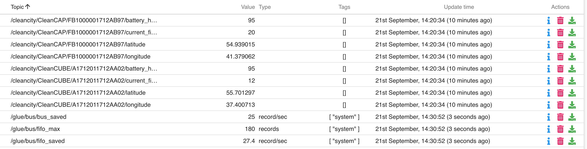  

При линейном виде ("Linear View"), данные отображаются в виде таблицы.

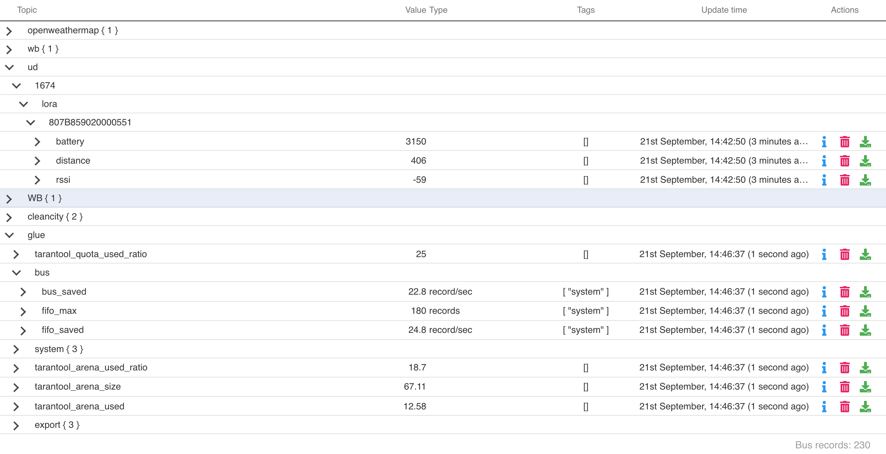  

При древовидном режиме отображения, данные группируются по составляющим названия топика, разделенным символом "/".  
```
/cleancity/CleanCAP/FB1000001712AB97/battery_health
/cleancity/CleanCAP/FB1000001712AB97/current_fill_level
```  

К примеру, эти два топика будут сгруппированы и получится такая древовидная структура:  
  
```
cleancity+
         +->CleanCAP+
                    +->FB1000001712AB97+
                                       +->battery_health
                                       +->current_fill_level
```  

В обоих режимах отображения, у топика доступны следующие поля:

- **Topic** - название топика
- **Value** - последнее полученное с шины значение топика
- **Type** - тип поступающих данных (формат, единица измерения и т.п.)
- **Tags** - теги топика
- **Update Time** - время последнего обновления топика
- **Actions** - действия, которые можно совершать с топиком (открыть окно редактирования данных топика, удалить топик)

### Окно подробной информации о топике

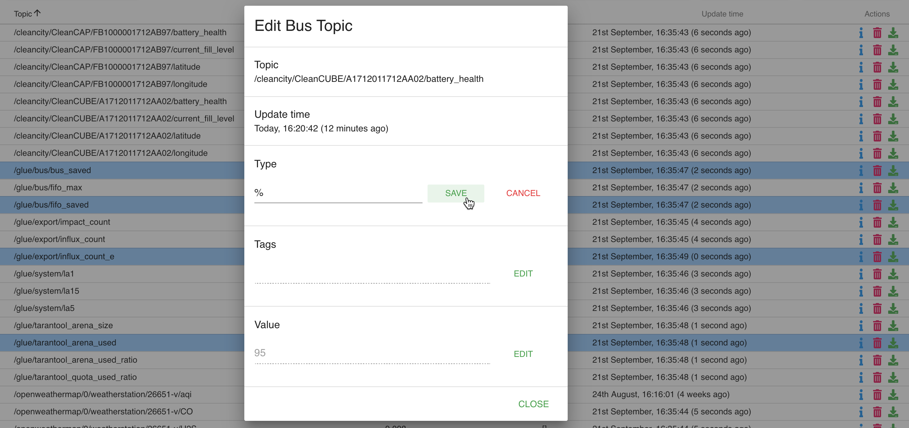

В этом окне можно изменить данные топика (тип Type, теги Tags, значение Value), храняшиеся в шине. 

После ввода данных в поле нажмите Save и данные будут отправлены на шину.

## Панель просмотра логов

Логи - информация (в основном - диагностическая), поступающая от драйверов и скриптов Glue.

Логи представленны в виде таблицы, где каждая запись содержит:
- **Level** - тип записи. Могут быть - _INFO_, _WARNING_, _ERROR_, _USER_
- **Source** - драйвер или скрипт, создавшие запись.
- **Date** - дата создания записи (относительная или абсолютная, переключается нажатием на заголовок столбца)
- **Entry** - содержимое записи в текстовом виде.
- **Info** - кнопка для открытия модального окна с полной информацией и событии.

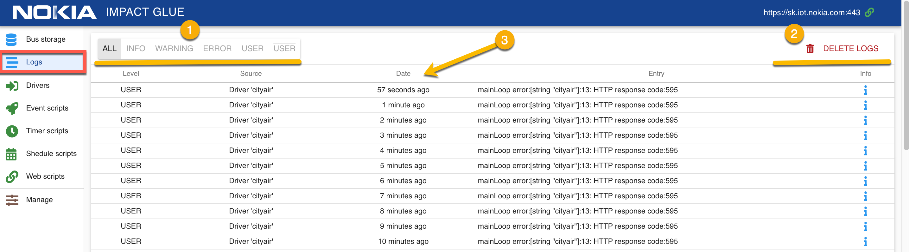

В верхней части страницы присутствуют следующие элементы управления:
1. Переключатель типа записей (Level).
2. Кнопка, удаляющая все логи.
3. По нажатию на заголовки таблицы, можно переключаться между абсолютным и относительным отображением даты.

## Интерфейс скриптов

Скрипты — это обособленные части кода, которые реализуют прикладную логику: расчет, изменение, реакции, выдача данных.  

Скрипты бывают нескольких видов:  
- **Драйвера** (Drivers)
- **Event-cкрипты** (Event scripts)
- **Timer-cкрипты** (Timer scripts)
- **Schedule-cкрипты** (Schedule scripts)
- **Webevent-cкрипты** (Web scripts)

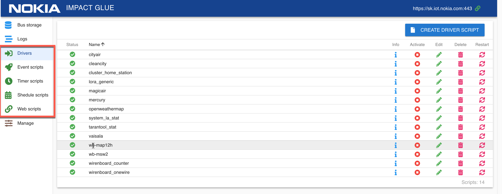

Подробную информацию о разработке драйверов и скриптов можно получить в [руководстве для разработчиков](developers.md).

### Драйвера

Драйвера - это скрипты, предназначенные для получения данных с различных устройств и отправке их в обработанном виде на шину.  

Список драйверов представлен в виде таблицы. Для каждого драйвера доступны поля:  
- **Status** - текущее состояние драйвера (возможные варианты - запущен, неактивен, предупреждение)
- **Name** - название драйвера
- **Info** - открыть модальное окно с подробной информацией о драйвере
- **Activate** - активировать/деактивировать драйвер
- **Edit** - редактировать драйвер
- **Delete** - удалить драйвер
- **Restart** - перезапустить драйвер

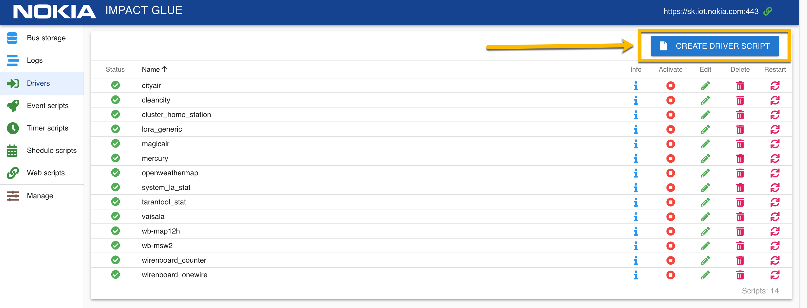  

Для создания нового драйвера, нажмите на кнопку "Create Driver Script", введите в открывшемся модальном окне название драйвера и нажмите кнопку "Create".

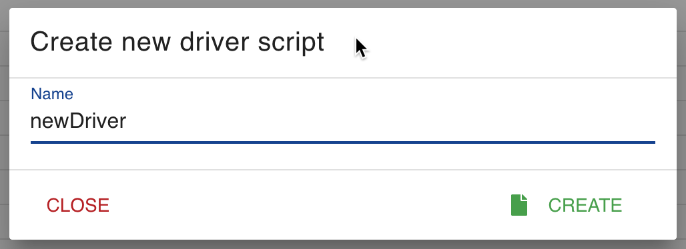  

В результате этой операции, в списке драйверов появится новый драйвер со статусом "неактивен". Теперь, можно написать код нашего драйвера и запустить его.

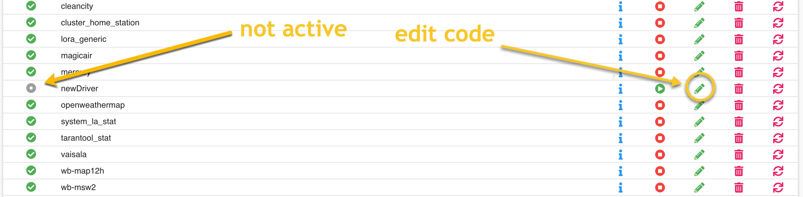  

На странице редактирования драйвера расположены: 
1. **BACK** переход обратно к списку драйверов 
2. **ACTIVATE** - активировать/деактивировать текущий драйвер
3. **SAVE** - сохранить текущий драйвер
4. **SAVE AND RESTART** - сохранить текущий драйвер и перезапустить его
5. **HIDE LOGS** - скрыть логи драйвера в нижней части страницы
6. Стрелки вниз/вверх для увеличения/уменьшения размера области с логами драйвера
7. **HELP** - открыть модальное окно со списком доступных переменных и функций
8. Область для редактирования кода скрипта.
9. Область отображения логов данного скрипта.

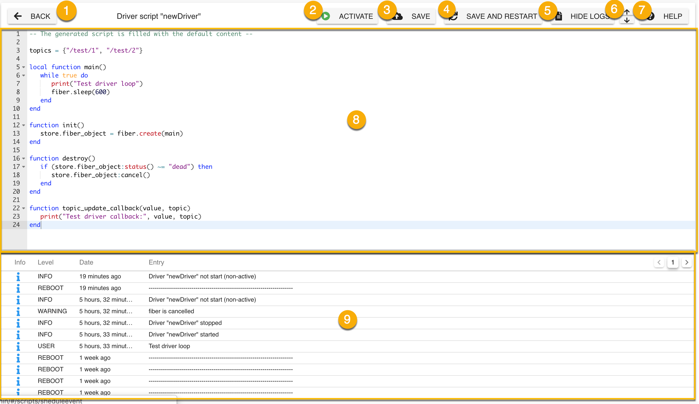  

> Обратите внимание!   
> Для запуска скрипта или драйвера, его нужно сначала активировать. При активации, будет предпринята попытка автоматического запуска скрипта.
> Если нажимать "Save And Restart" для неактивированного скрипта, то он будет только сохранен, но не запущен.  
> Скрипт, находящийся в активном состоянии, Glue будет пытаться включить непосредственно в момент активации и каждый раз при перезапуске. Скрипт можно принудительно перезапустить, если это необходимо.  
  Неактивные скрипты никак не участвуют в работе системы до момента их активации.  

При разрабоке драйверов или скриптов, часто бывает нужно получить информацию о значении каких-либо переменных, например вывести полученные данные от устройства.  
Это можно сделать, используя систему логов непоредственно на странице редактирования скрипта.  
По нажатию на кнопку "i" около события в списке логов можно получить информацию, необходимую для отладки скрипта.  

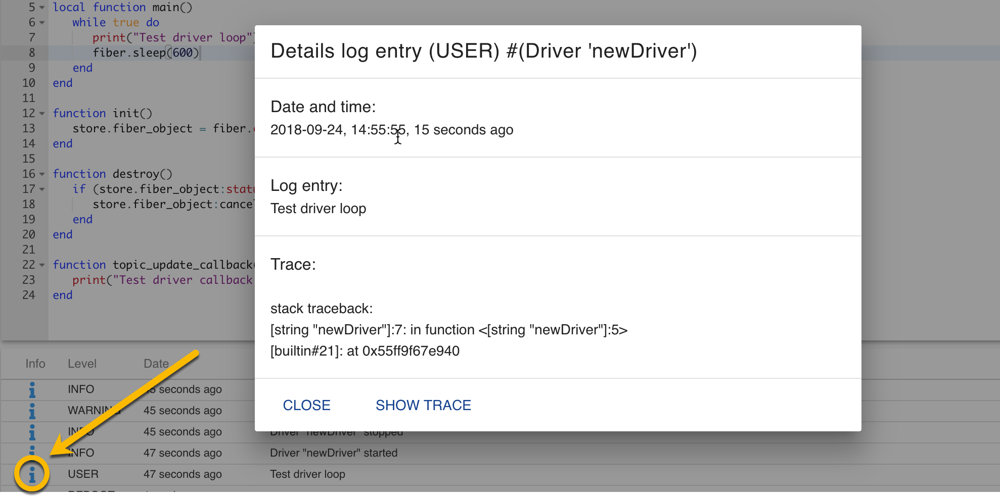  

### Event-cкрипты

Скрипты, которые запускаются при возникновении определенных условий.  
Event-скрипты предназначены для отслеживания событий, происходящих на шине и реакции на эти изменения.  
С помощью них можно, например:  
- создать оповещения о превышении предельных значений на объектах мониторинга  
- расчитывать приращение наблюдаемой величны (скорость изменения) и записывать его в отдельный топик  

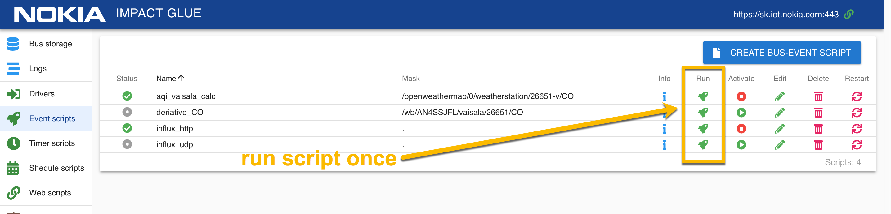  

Внешний види списка Event скриптов в целом аналогичен списку драйверов, за исключением:
- у Event скриптов есть поле Mask, определяющее список топиков, которые скрипт отслеживает
- Event скрипты можно запускать однократно (есть поле "Run Once")

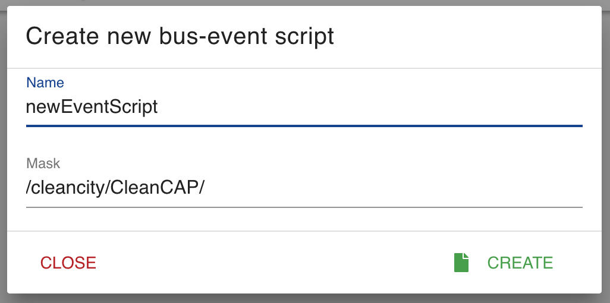  

При создании Event скрипта нужно указать не только его название, но и маску.  
Маска определяет количество топиков, изменения которых будет прослушивать скрипт.  
К примеру, указанная на картинке маска будет прослушивать все топики, начинающиеся на /cleancity/CleanCap/:  

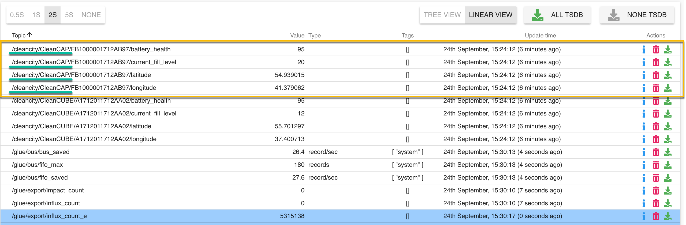

При нажатии на кнопку Info у Event-скрипта, можно не только получить подробную информацию о нем, но и изменить маску прослушиваемых топиков:  
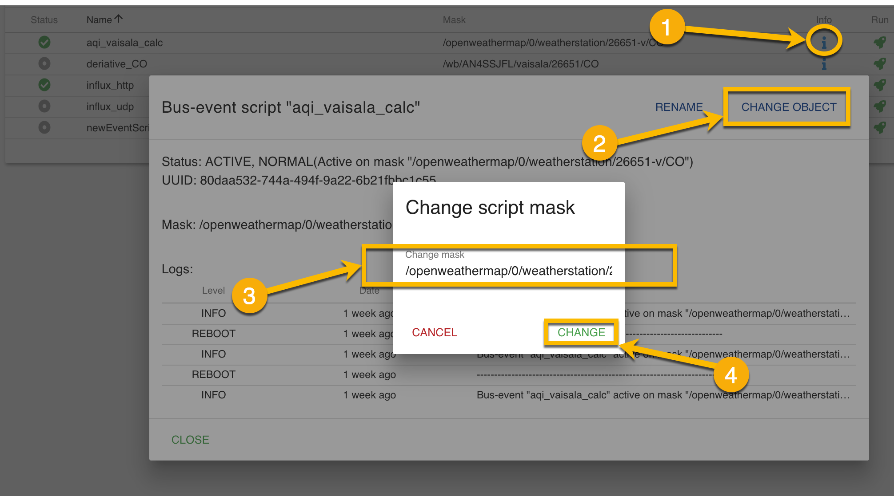  

На странице редактирования Event-скрипта доступен тот-же функционал, что и на странице редактирования кода драйвера, но также есть возможность редактирования маски прослушиваемых топиков.  
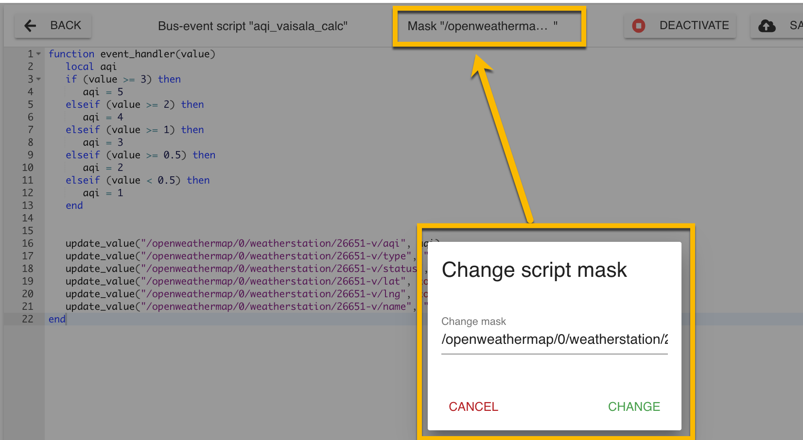 

### Timer-cкрипты  

Скрипты, которые запускаются с определенным интервалом.
При создании Timer-скрипта, нужно ввести **интервал в секундах (Period)** , с которым он будет запускаться. Интервал отображается в поле Period в списке Timer-скриптов.

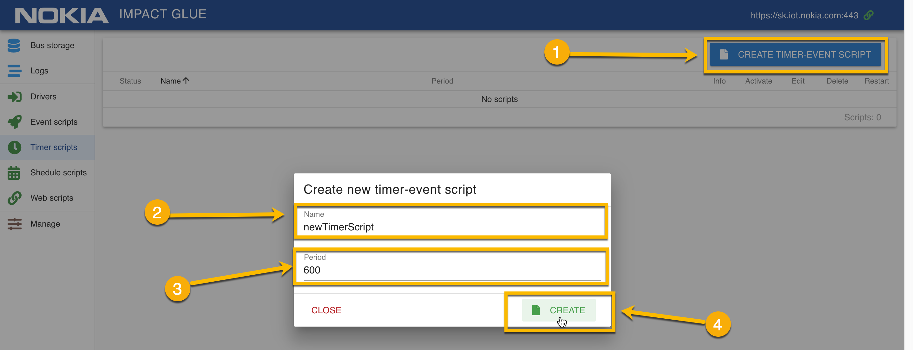

Создание и редактирование кода Timer-скрипта аналогично созданию кода драйвера или Event-скрипта.

### Shedule-cкрипты

Скрипты, которые запускаются по расписанию. 

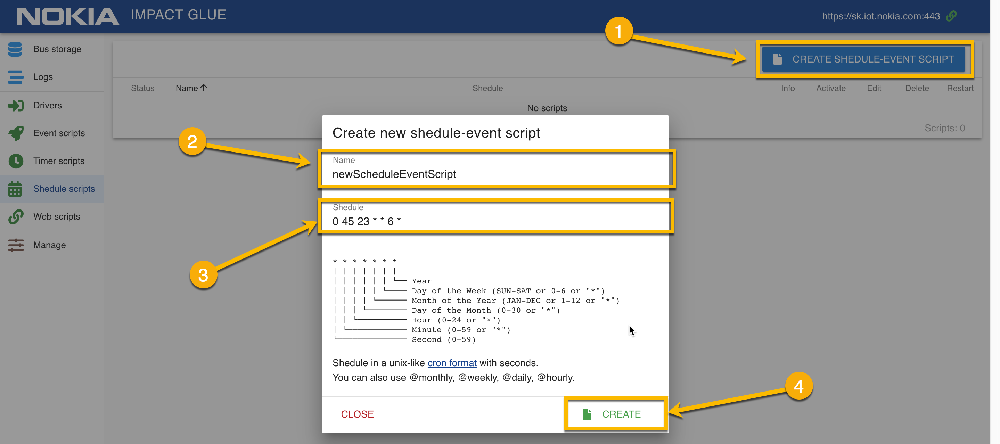

Для создания Schedule-скрипта:
- нажмите кнопку "Create Shedule-Event Script"
- введите имя скрипта
- введите расписание скрипта в формате crontab
- нажмите кнопку  "Create"

В показанном на скриншоте примере, расписание, скрипт будет выполнен каждую субботу в 23:45.
```
0 45 23 * * 6 *
│ │  │  │ │ │ │
│ │  │  │ │ │ └── Каждый год
│ │  │  │ │ └──── По субботам
│ │  │  │ └────── Каждый месяц
│ │  │  └──────── Каждый день месяца
│ │  └─────────── В 23 часа
│ └────────────── В 45 минут
└──────────────── В 0 секунд
```

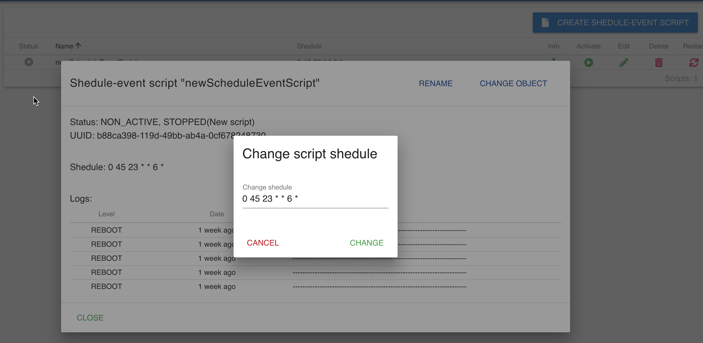

Изменить расписание Schedule скрипта можно в окне с подробной информацией о скрипте и на странице редактирования скрипта (в верхней части).


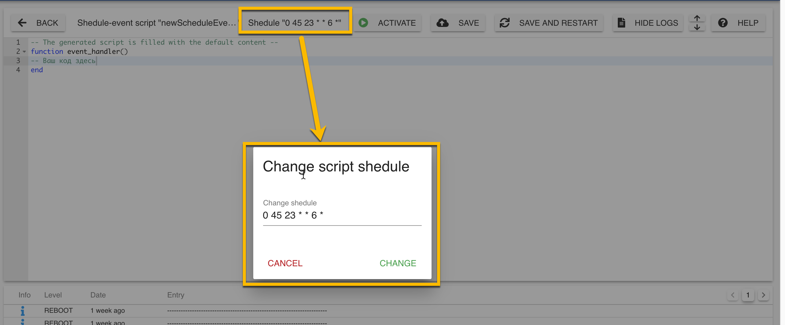  

### Webevent-cкрипты

Webevent запускаются при HTTP запросе на определенный URL, который формируется из URL инстанса Glue и endpoint, задаваемым пользователем при создании скрипта.

С помощью Webevent-скриптов можно:  
- создать API, которое будет предоставлять внешним клиентам данные с шины в формате XML, JSON или любом другом. 
- принимать управляющие воздействия от взаимодействующих с Glue внешних систем через HTTP запросы
- создавать несложные web-страницы для user-friendly отображения данных шины для нетехнических пользователей

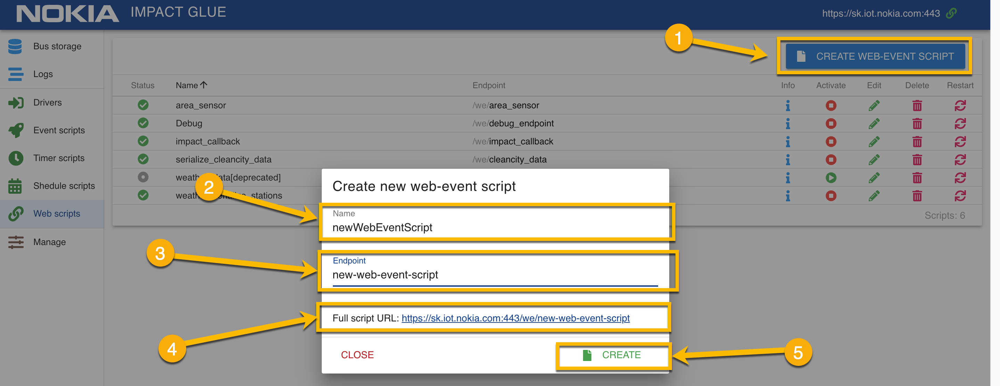  

Для создания нового Webevent-скрипта:
1. Нажмите кнопку "Create Web-Event Script"
2. Введите название скрипта
3. Введите желаемый endpoint скрипта
4. Проверьте результирующий URL, который будет использоваться для вызова скрипта
5. Нажмите кнопку "Create"

Изменить endpoint можно как в редакторе кода скрипта, так и в окне подробной информации о скрипте.

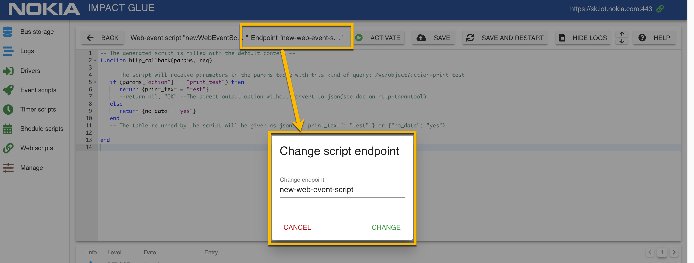 

Процесс написания кода как Webevent-скриптов, так и других типов скриптов подробно рассмотрен в [руководстве для разработчиков](developers.md)

## Панель управления системой 

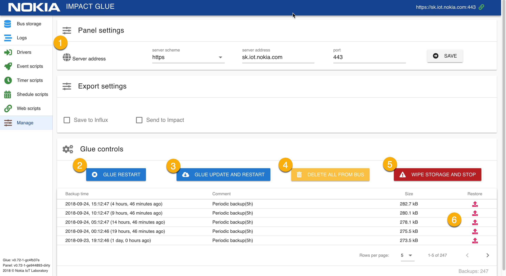 

В панели управления системой (вкладка Manage) можно:  
1. выбрать сервер, с которым будет работать панель
2. перезапустить сервис Glue
3. перезапустить Glue с обновлением (выполняется git reset --hard, будут перезаписаны все изменения в коде Glue! )
4. удалить все данные из центральной шины
5. очистить все хранилище данных
6. восстановить Glue из бэкапа

### Раздел настройки адреса сервера

Панель управления Glue является независимым фронтендом к системе Glue и может быть запущена в любом месте, даже локально.

Связь с Glue происходит по HTTP(S) протоколу.

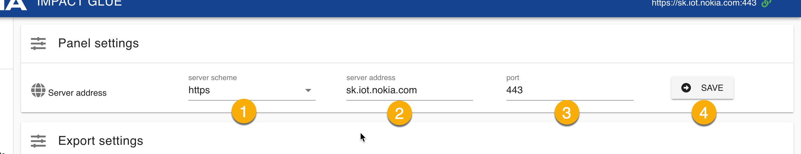 

Для настройки адреса сервера Glue:
1. Выберите протокол - http или https
2. Укажите адрес сервера без http или https
3. Укажите порт, который прослушивает сервер Glue
4. Нажмите "Save"

### Система восстановления из бекапа

Glue производит периодический бэкап системы каждые 5 часов. 
Происходит бэкап:
- настроек glue
- состояния шины
- логов
- драйверов и их статусов

В любой момент, вы можете откатиться до любого из доступных бэкапов.

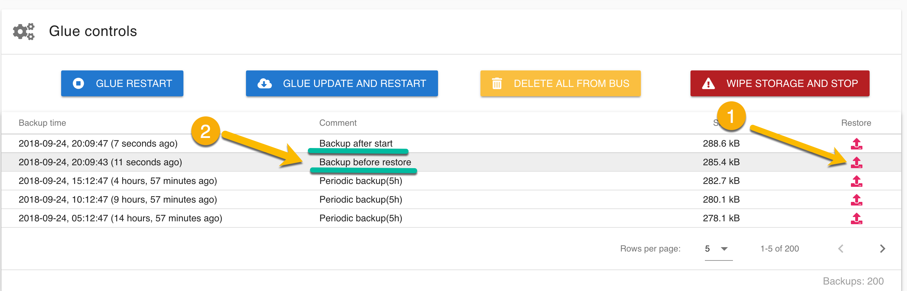 

Для восстановления из бэкапа, выберите точку восстановления из списка и нажмите кнопку "Restore" (1).  
После восстановления из бэкапа, будут созданы еще 2 точки восстановления - "Backup before restore" и "Backup after start". (2)  
"Backup before restore" - это бэкап системы, которая была до загрузки данных из выбранной точки восстановления.
"Backup after start" - бэкап системы после загрузки данных из точки восстановления.  
Такой подход позволяет гарантировать отсутствие риска потери данных при восстановлении из бэкапов.  