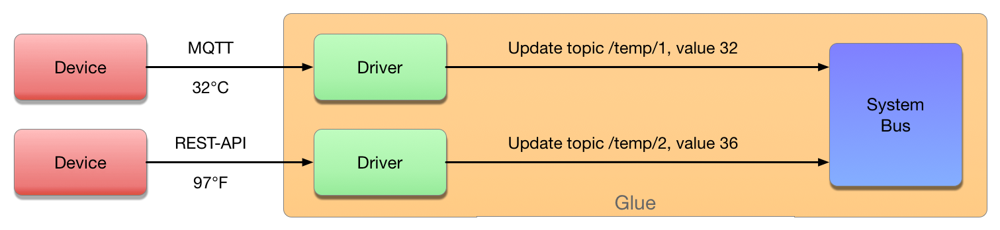
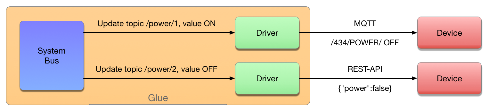

# Драйвера и разные типы скриптов

## Драйвера
Драйвера нужны для соединения внешних устройств с общей шиной. 
Допустим, у вас есть несколько датчиков температуры.  
Один — с интерфейсом Modbus, подключённый через конвертер RS485-TCP, второй — подключённый по радиоканалу LoRa, базовая станция которой отдаёт данные в виде MQTT, третий — от сторонней компании, показания которого забираются через REST-API, вдобавок ещё и в градусах Фаренгейта.  
Вы не можете сравнивать показания этих датчиков напрямую, потому что первый отдаёт показания по запросу, второй сам отправляет их раз в час, третий можно запрашивать только раз в пять минут: вам нужен механизм, который бы генерировал запросы к датчикам с нужной частотой, и механизм, который бы хранил последние значения(для синхронизации данных, следующих с разной частотой).  
В системе GLUE первый механизм — это драйвера устройств, а второй — общая шина.  

Драйвер — это скрипт, реализующий конкретный протокол взаимодействия с датчиком (в данном случае — получения данных о температуре), и транслирующий его в команды изменения данных на шине.  

Получаем изменение значения топика MQTT — превращаем его в команду изменения топика в общей шине.  
Получаем ответ на HTTP-запрос в формате JSON — превращаем его в команду изменения топика в общей шине.  
Приходящие данные в разных протоколах и форматах конвертируются драйверами в универсальные изменения топиков общей шины.  
И наоборот — существует механизм, с помощью которого драйвер может узнать о изменении топика и отправить изменённое значение обратно устройству.  

## Bus-event
Нужны для быстрой реакции на события.   
В них можно проверять выход температуры за уставки: при каждом изменении топика с данными датчика температуры запускается скрипт и проверяет, не превысила ли температура определенную границу. Если превысила, то изменяется топик "питание системы охлаждения", который преобразуется драйвером в команду включения системе охлаждения.

## Timer-event
Нужны для реакции на события, которые могут не подразумевать изменение состояния топиков.  
Например, два датчика движения, которые изменяет состояние топика только в случае начала движения и конца движения.  
Если мы хотим выключать свет при отсутствии движения более 10 минут на двух датчиках одновременно, на bus-event это возможно сделать только с привлечением потоков.  
Timer-event может запускаться раз в минуту и проверять, находятся ли оба датчика в состоянии "нет движения" и находятся ли они в этом состоянии больше 10 минут. В случае совпадения — изменяет топик "яркость освещения".  

## Schedule-event
Для регулярных действий, которые должны повторяться раз в неделю, или только по определённым дням, слишком сложно высчитывать промежутки в секундах между событиями. Скрипты, выполняемые по расписанию, могут запускаться не с одинаковым периодом, а согласно установленному расписанию. Формат расписания совместим с форматом crontab.  

Например, если необходимо выключать освещение в офисе в 7 часов вечера только по будним дням, мы можем сделать скрипт, который будет менять значение топика, который управляет освещением и запустить его со следующим расписанием: **0 0 19 * * MON-FRI *** (что означает "в 0 секунд, в 0 минут, в 19 часов каждый день каждого месяца, в дни недели с понедельника по пятницу, каждого года"). Если же надо выключать свет, только если отсутствует движение, то в коде скрипта можно сделать проверку на состояние топика, который сообщает о наличии движения.  

> Обратите внимание! Взаимодействие с внешними устройствами в событийных скриптах возможно, но нежелательно — для этого существуют драйвера. Логика работы системы подразумевает, что скрипты получают информацию с топиков шины и изменяют информацию на топиках шины. Для общения с внешним миром существуют драйвера(которые в свою очередь, должны конвертировать данные, но не реализовывать конечную логику).  
> Таким образом, достигается разделение на код, который реализует бизнес-логику, и вспомогательный код, который обеспечивает взаимодействие с устройствами. При соблюдении этих принципов проектирования, становится возможным заменять устройства (с их драйверами) на другие, без необходимости вносить изменения в бизнес-логику.

## Web-event
Как правило, эти скрипты используются для реализации более высокоуровневого API.   
Например, пользовательского веб-интерфейса, на котором показывается список датчиков температуры и поле для ввода значения максимальной температуры. Веб-интерфейс запрашивает у web-event скрипта данные и отправляет команду "изменить значение топика с уставкой по температуре".  
